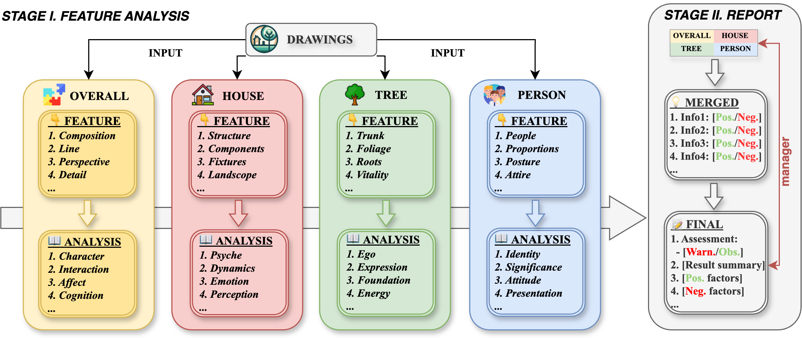
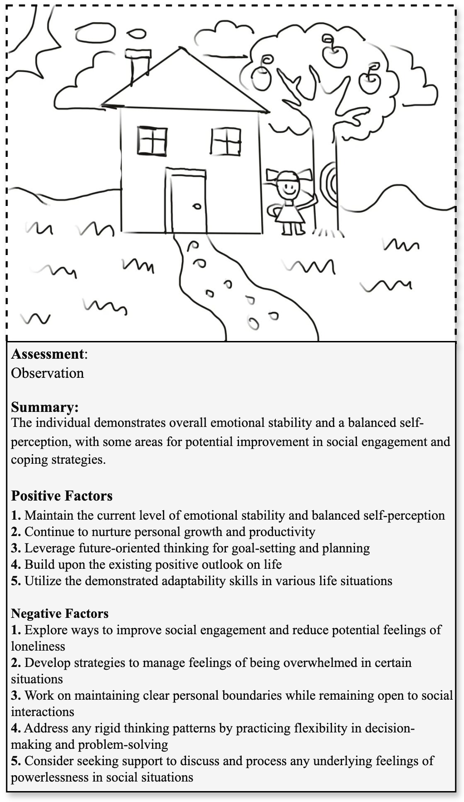

<p align="center">
  
</p>

<h1 align="center">PsyDraw: 面向留守儿童心理健康检测的多智能体多模态系统</h1>

<p align="center">
  <a href="README.md">
    
  </a>
  <a href="README_CN.md">
    
  </a>
  <a href="LICENSE">
    
  </a>
  <a href="https://arxiv.org/abs/2412.14769">
    
  </a>
</p>

<p align="center">
  
</p>

## ⚠️ 重要伦理声明及专业使用指南

**重要提示：本系统严格设计为专业筛查辅助工具**

出于心理健康评估的伦理考虑，本仓库仅包含项目代码结构。为防止滥用并确保正确应用，系统的提示词和分析组件并未开源。

### 仅供专业人士使用
- 本工具专门设计用于协助合格的心理健康专业人员（精神科医生、心理咨询师和学校心理辅导员）进行初步筛查
- 严禁未经专业培训的个人用于自我评估或互相评估
- 所有结果必须由具有资质的心理健康专业人员解释和验证

### 完整系统访问
如需出于研究或临床目的访问完整系统（包括提示词），请联系我们：[project.htp@lyi.ai]。访问权限将仅在满足以下条件后授予：
1. 专业资质验证
2. 使用目的审核
3. 同意伦理准则和使用条款

### 风险防范
- 心理评估工具的滥用可能导致错误解读和潜在危害
- 系统应仅在专业人员监督下的专业环境中部署
- 所有实施必须遵守心理健康评估相关的伦理准则和法规

## 项目概述
在中国，超过6600万留守儿童由于父母外出务工面临严重的心理健康挑战。早期筛查和识别高风险留守儿童至关重要，但由于心理健康专业人员严重短缺（尤其是在农村地区），这项工作面临巨大挑战。虽然房树人测验（HTP）显示出较高的儿童参与度，但其对专业解释的需求限制了其在资源匮乏地区的应用。为解决这一挑战，我们提出了PsyDraw，一个基于多模态大语言模型的多智能体系统，用于协助心理健康专业人员分析HTP绘画。该系统采用专门的智能体进行特征提取和心理解释，分两个阶段运作：全面特征分析和专业报告生成。对290名小学生的HTP绘画评估显示，71.03%的分析与专业评估达到高度一致，26.21%达到中度一致，仅2.41%为低度一致。系统识别出31.03%的案例需要专业关注，展示了其作为初步筛查工具的有效性。目前已在试点学校部署的PsyDraw显示出在支持心理健康专业人员方面的潜力，特别是在资源有限的地区，同时保持心理评估的高专业标准。

<p align="center">
  
  <br>
  <em>图1: PsyDraw的工作流程</em>
</p>

## ✨ 主要特点

<p align="center">
  
  
  
  
</p>

## 🚀 快速开始

### 安装

1. 克隆仓库：
```bash
git clone https://github.com/LYiHub/psydraw.git
cd PsyDraw
```

2. 安装依赖：
```bash
pip install -r requirements.txt
```

3. 设置环境变量：
- 复制 `.env_example` 文件并重命名为 `.env`
- 填写您的API密钥和基础URL

### 使用方法

<p align="center">
  
  
  
  
</p>

#### 1. 直接调用
```bash
bash run.sh
# 或
python run.py --image_file example/example1.png --save_path example/example1_result.json --language zh
```

#### 2. API集成
```bash
python deploy.py --port 9557
```
服务运行于 `http://127.0.0.1:9557`

#### 3. 网页演示
```bash
bash web_demo.sh
# 或
streamlit run src/main.py
```

#### 4. 打包应用
```bash
pyinstaller htp_analyzer.spec
```

## 📊 案例研究
<p align="center">
  
   
</p>

## ⚖️ 许可证

本项目采用GPL-3.0许可证。详情请参见[LICENSE](LICENSE)文件。

## ⚠️ 免责声明

PsyDraw严格作为专业筛查辅助工具。它不得作为独立的诊断工具或替代专业医疗评估。该系统旨在支持而非取代合格心理健康专业人员的专业知识。任何系统的实施或使用都必须在专业监督下进行。 

## 📚 引用

如果您觉得本工作对您有帮助，请引用我们的论文：

```bibtex
@misc{zhang2024psydrawmultiagentmultimodalmental,
      title={PsyDraw: A Multi-Agent Multimodal System for Mental Health Screening in Left-Behind Children}, 
      author={Yiqun Zhang and Xiaocui Yang and Xiaobai Li and Siyuan Yu and Yi Luan and Shi Feng and Daling Wang and Yifei Zhang},
      year={2024},
      eprint={2412.14769},
      archivePrefix={arXiv},
      primaryClass={cs.CL},
      url={https://arxiv.org/abs/2412.14769}, 
}
```
  </rewritten_file>